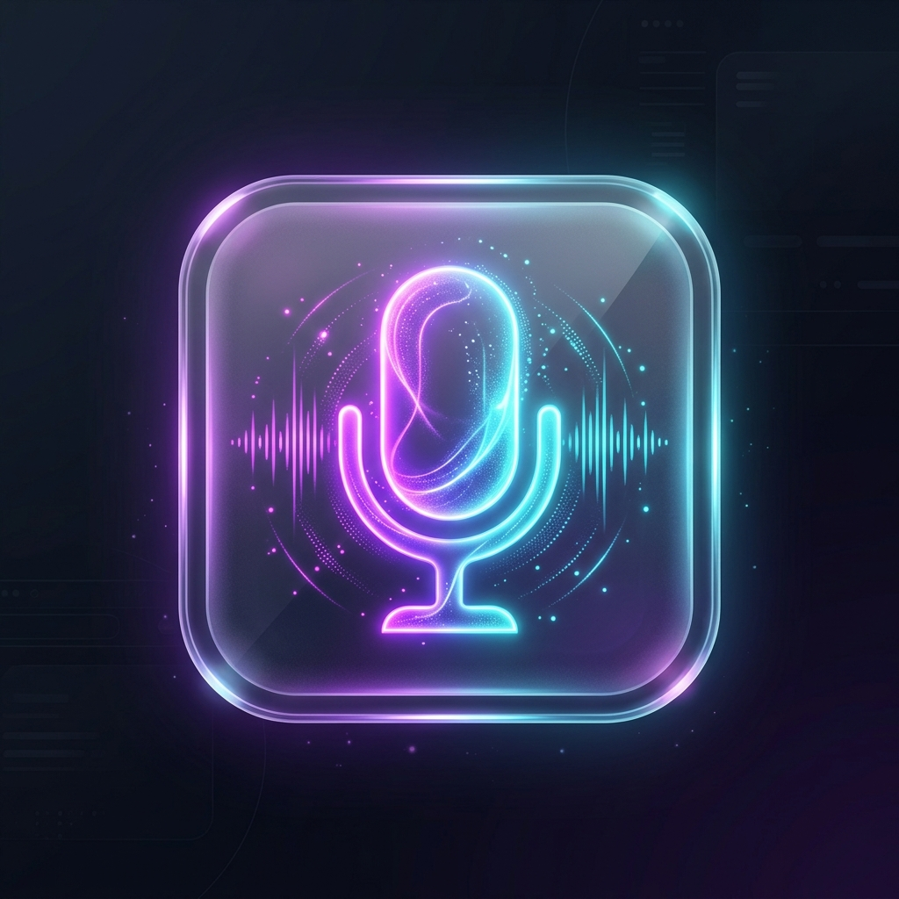

<div align="center">
  
  <h1>MurMur: Your AI Voice Prompting Solution 🎙️</h1>
  <p><strong>Free, lightning-fast, and entirely local voice-to-text for AI workflows.</strong></p>

  [](https://opensource.org/licenses/MIT)
  []()
  [](https://tauri.app/)
  [](https://github.com/ggerganov/whisper.cpp)
</div>

---

## 🌟 Overview

**MurMur** is the ultimate AI voice-prompting tool designed for developers, writers, and power users. Instead of painstakingly typing out massive prompts for ChatGPT, Claude, or Cursor, simply hold a hotkey, speak naturally, and let MurMur instantly transcribe your voice and drop the text directly into your active window.

The best part? It runs **100% locally** using the incredibly optimized `whisper.cpp` engine. No cloud subscriptions, no internet connection required for transcription, and absolute privacy for your voice data.

## ✨ Features

- **🚀 Lightning Fast:** Instant transcription utilizing hardware-accelerated local inference.
- **🔒 100% Private & Local:** Your audio never leaves your machine. Powered by OpenAI's Whisper (running entirely on your CPU/GPU).
- **⌨️ Universal Auto-Paste:** Press `Cmd + Shift + Space` (Mac) or `Ctrl + Shift + Space` (Win/Linux), speak, and release. Your transcription is automatically typed into whatever app you're using (IDE, Browser, Slack, etc.).
- **🎤 Advanced Audio Normalization:** Handles any microphone sample rate dynamically (resampling seamlessly to 16kHz) to ensure zero AI "hallucinations."
- **🎨 Beautiful Native UI:** Designed with modern glassmorphism, staying quietly in your system tray/menu bar until you need it.
- **🤖 VoxCoder Mode:** Automatically formats your spoken code concepts into structured, AI-ready prompts for LLMs.

---

## 📥 Download & Installation

The easiest way to use MurMur is to download the pre-built installer for your operating system. **You do not need to build it from source!**

1. Go to the [**Releases**](../../releases/latest) page on GitHub.
2. Download the installer for your system:
   - **macOS:** Download the `.dmg` file.
   - **Windows:** Download the `.exe` setup file.
   - **Linux:** Download the `.AppImage` or `.deb` file.
3. Install and run! (You may need to allow accessibility/microphone permissions on first launch).

---

## 🛠️ Usage

1. **Launch MurMur.** You'll see the 🎙️ icon appear in your system tray / macOS menu bar.
2. Click the icon and select **Settings** to customize your experience and ensure the base AI model is downloaded.
3. Anywhere on your computer, press and hold `Cmd + Shift + Space` (Mac) or `Ctrl + Shift + Space` (Win/Linux).
4. **The recording overlay will appear.** Speak your prompt naturally.
5. **Release the hotkeys.** MurMur will transcribe and automatically paste the text directly into your active window!

---

## 🏗️ For Developers: Build from Source

If you want to contribute or build MurMur yourself, you're in the right place!

1. **Clone the repository:**
   ```bash
   git clone https://github.com/Mr-ABX/MurMur.git
   cd MurMur
   ```
2. **Install dependencies:**
   ```bash
   npm install
   ```
3. **Run the development server:**
   ```bash
   npm run tauri dev
   ```
4. **Build the production app (DMG, EXE, etc):**
   ```bash
   npm run tauri build
   ```

*MurMur's Stack:*
- **Frontend:** React, TypeScript, TailwindCSS, Vite
- **Backend/Desktop:** Rust, Tauri v2
- **AI Engine:** `whisper.cpp` (via `whisper-rs`)
- **Audio Capture:** `cpal` with real-time linear downsampling
- **System Automation:** `tauri-plugin-clipboard-manager` & native Enigo

## 🤝 Contributing

Contributions, issues, and feature requests are highly welcome! Feel free to check the [issues page](https://github.com/Mr-ABX/MurMur/issues). If you have a great idea, fork the repo and submit a PR.

## 📄 License

This project is [MIT](https://opensource.org/licenses/MIT) licensed.
