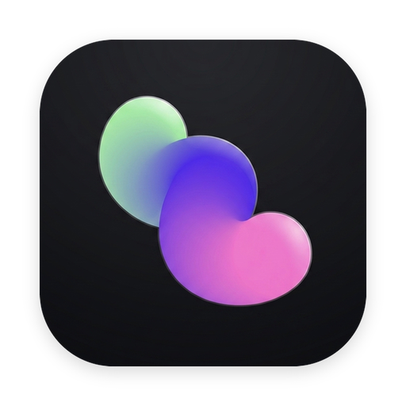
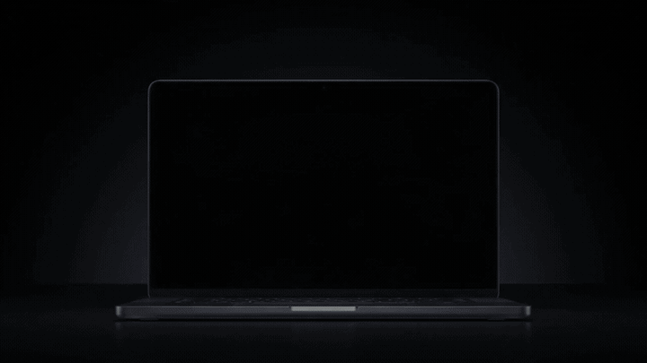

<div align="center">
  
  <h1>MurMur: Ambient AI Voice & Assistant Operating System 🎙️⚡</h1>
  <p><strong>Lightning-fast local Whisper dictation, Dynamic Notch overlay, and screen-aware AI assistant for macOS & Windows.</strong></p>

  [](https://github.com/Mr-ABX/MurMur/releases/tag/v0.3.0)
  [](https://github.com/Mr-ABX/MurMur/releases/latest)
  [](https://opensource.org/licenses/MIT)
  []()
  [](https://tauri.app/)
  [](https://github.com/ggerganov/whisper.cpp)
</div>

<br>

<div align="center">
  
</div>

---

> [!NOTE]
> ### 🚀 MurMur v0.3.0 Release
> **MurMur v0.3.0 is live with major upgrades:**
> 
> - 🏝️ **Dynamic Island & MacBook Notch**: Smooth fluid spring physics, Apple Intelligence glowing sinusoidal AI wave, and auto-hidden activation.
> - ⚡ **Native CoreAudio 60 FPS Audio Engine**: Sub-millisecond RMS level streaming from Rust to UI with 0ms visual latency.
> - 🎙️ **100% Local Whisper Voice Dictation**: Instant auto-paste into active apps (`Option+Space` / custom shortcut).
> - 🧑‍💻 **VoxCoder Mode**: Smart voice formatting for developers (`camelCase`, `snake_case`, brackets, symbols).
> - 🛠️ **Upcoming in Future Roadmap**:
>   - 🤖 **Screen-Aware AI Vision Assistant**: In active development.
>   - 📝 **Auto Voice Note-Taking & Tasks**: In active development.
>   - Built-in embedded GGUF engine for 100% offline assistant reasoning.
> 
> 💬 *Found a bug or have a suggestion? We'd love to hear from you! Please [open an Issue](https://github.com/Mr-ABX/MurMur/issues) or join the discussion.*

---

## 💡 What Makes MurMur Unique (The Open-Source Wispr Flow + Otter.ai Alternative)

Tired of expensive **$15–$20/month subscriptions**, cloud audio logging, and heavy background apps that hog your CPU and RAM?

**MurMur** is built from the ground up as a **100% free, forever open-source, and hardware-accelerated alternative** combining the lightning-fast dictation of Wispr Flow and Superwhisper with the ambient intelligence of Otter.ai.

| Feature | 🎙️ **MurMur** | ☁️ **Wispr Flow** | 🦦 **Otter.ai** | 🏷️ **Superwhisper** | 🍎 **MacWhisper Pro** |
| :--- | :---: | :---: | :---: | :---: | :---: |
| **Pricing** | **100% Free & Open-Source** | $15 / month | $10–$20 / month | $8.99 / mo or $199 | €29 – €49 (Pro) |
| **Audio Privacy** | **100% Local (Never leaves device)** | Sent to Cloud | Sent to Cloud | Hybrid / Local | Local |
| **Disk Footprint** | **~150 MB (Base model)** | 500 MB+ | Web / Mobile | 1.2 GB+ | 1.5 GB+ |
| **RAM Usage** | **~35 MB Idle (~120MB Peak)** | ~250 MB+ | ~300 MB+ | ~400 MB+ | ~500 MB+ |
| **Universal Auto-Paste** | **Instant (Zero popups)** | Yes | ❌ (Manual Copy) | Yes | Manual / Dictation |
| **Dynamic Island & Notch UI** | **Yes (Floating Pill + AI Wave)** | ❌ None | ❌ None | ❌ None | ❌ None |
| **VoxCoder Mode** | **Yes (Spoken Code $\rightarrow$ Identifiers)** | ❌ None | ❌ None | ❌ None | ❌ None |
| **Auto Note-Taking & Tasks** | **🛠️ Coming Soon** | ❌ None | ✅ Yes | ❌ None | ❌ None |
| **Screen-Aware AI Assistant** | **🛠️ Coming Soon** | ❌ None | ❌ None | ❌ None | ❌ None |
| **Platform Support** | **macOS & Windows** | macOS only | Web / Mobile | macOS only | macOS only |

### 🚀 Why Creators & Developers Choose MurMur:

- 💸 **100% Free Forever**: No subscriptions, no hidden token limits, no paywalls, and no credit card required.
- 🪶 **Ultra-Lightweight (~150 MB Disk & ~35 MB Idle RAM)**: Unlike heavy Electron or Python apps, MurMur is compiled natively with **Rust & Tauri v2**, consuming negligible system memory so your computer stays blazing fast.
- ⚡ **Seamless "Type Anywhere" Dictation**: Press your shortcut (`Option+Space` / customizable), speak naturally at 150+ words per minute, and release. MurMur instantly types your words directly into Cursor, VS Code, Slack, Notion, Claude, or ChatGPT.
- 🏝️ **Dynamic Island & Fluid Wave**: Minimal floating pill that expands dynamically when you speak and tucks away automatically when you're done.
- 💻 **VoxCoder Mode**: Formats raw speech into clean code identifiers (`camelCase`, `snake_case`, punctuation, brackets, syntax).
- 🤖 **Screen AI & Notes (Coming Soon)**: Multi-monitor screen context reasoning and natural voice note taking in active development.

---

## 🌟 Overview

**MurMur** is the ultimate ambient voice intelligence and AI prompting assistant designed for developers, writers, and power users. Instead of typing out massive prompts for ChatGPT, Claude, or Cursor, simply hold your hotkey, speak naturally, and let MurMur transcribe, format, and auto-paste text directly into your active window.

With **v0.3.0**, MurMur introduces the **Dynamic Island** with smooth spring animations, a **60 FPS CoreAudio engine**, glowing **sinusoidal AI Wave**, and customizable activation modes.

---

## ✨ Feature Breakdown & Status

| Feature | Status | Description |
| :--- | :---: | :--- |
| **100% Local Whisper Dictation** | ✅ **Live** | Zero-latency, private on-device speech transcription via `whisper.cpp`. |
| **Dynamic Island & Notch Overlay** | ✅ **Live** | Interactive floating pill with spring physics and auto-hidden activation. |
| **Fluid AI Wave Visualizer** | ✅ **Live** | Apple Intelligence glowing sinusoidal wave driven by real-time audio levels. |
| **VoxCoder Mode** | ✅ **Live** | Formats spoken programming syntax into `camelCase`, `snake_case`, and symbols. |
| **Universal Auto-Paste** | ✅ **Live** | Automatically types transcribed text directly into any active application. |
| **Multilingual Whisper Catalog** | ✅ **Live** | 99-language support with one-click atomic downloads. |
| **Auto Note-Taking & Task Router** | 🛠️ **Coming Soon** | Voice triggers (*"Take a note..."*, *"Add task..."*) routed to local workspace tabs. |
| **Screen-Aware Vision Assistant** | 🛠️ **Coming Soon** | Multi-monitor screen capture analyzed via Google Gemini 2.0 Flash / local Gemma. |

---

## 📥 Download & Installation

Download the latest pre-compiled installer for your operating system:

👉 **[Download MurMur from GitHub Releases](https://github.com/Mr-ABX/MurMur/releases/latest)**

- **macOS:** Download **`Murmur_0.3.0_aarch64.dmg`** (or Intel x64), open the `.dmg`, and drag MurMur into `/Applications`.
- **Windows:** Download **`Murmur_0.3.0_x64-setup.exe`** or **`.msi`** installer.
- Install and run! Allow microphone and accessibility permissions on first launch.

---

## 🛠️ Usage

1. **Launch MurMur.** You'll see the 🎙️ bird icon appear in your macOS menu bar / system tray.
2. Click the icon and select **MurMur Dashboard** to configure your model, hotkey, and preferences.
3. Anywhere on your computer, press `Option+Space` (or your customized hotkey).
4. **The Dynamic Island will appear.** Speak your prompt or code naturally.
5. Stop speaking or press the shortcut again. MurMur instantly pastes the text into your active window!

---

## 🏗️ For Developers: Build from Source

If you want to build or hack on MurMur yourself:

1. **Clone the repository:**
   ```bash
   git clone https://github.com/Mr-ABX/MurMur.git
   cd MurMur
   ```
2. **Install dependencies:**
   ```bash
   npm install
   ```
3. **Run the development server:**
   ```bash
   npm run tauri dev
   ```
4. **Build the production release:**
   ```bash
   npm run tauri build
   ```

*MurMur Stack:*
- **Frontend:** React 18, TypeScript, TailwindCSS, Framer Motion, Vite
- **Backend / Desktop:** Rust, Tauri v2, Objective-C / Cocoa bridge
- **AI Engine:** `whisper.cpp` (via `whisper-rs`)
- **Audio Capture:** `cpal` with real-time 60 FPS CoreAudio streaming

---

## 🤝 Contributing

We welcome contributions from developers, designers, and AI enthusiasts of all skill levels! Here is how you can get involved:

### How to Contribute
1. **Fork the Repository** on GitHub.
2. **Create a Feature Branch**:
   ```bash
   git checkout -b feature/amazing-new-feature
   ```
3. **Make your changes** and verify tests & lints:
   ```bash
   npm run test          # Run frontend tests
   cargo test            # Run Rust unit tests
   cargo clippy          # Check Rust code quality
   ```
4. **Commit your changes**:
   ```bash
   git commit -m "feat: add amazing new feature"
   ```
5. **Push to your branch**:
   ```bash
   git push origin feature/amazing-new-feature
   ```
6. **Open a Pull Request** describing your changes.

### 💬 Reporting Bugs & Feature Requests
- Found a bug or have an idea? Please [open an Issue](https://github.com/Mr-ABX/MurMur/issues) with reproduction steps or details.
- Join discussions and share feedback to help shape upcoming features!

## 📄 License

This project is [MIT](https://opensource.org/licenses/MIT) licensed.

